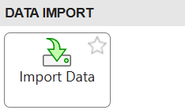
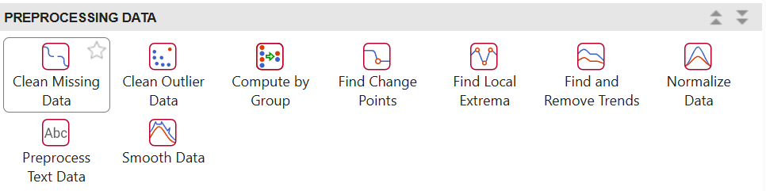
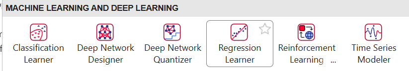

<a id="TMP_648c"></a>

# From Your Data to Regression Learner and Classification Learner

This live script fills the gap between *Structuring Data with Tables and Datastore* and *Machine Learning in Practice*: what does bias correction actually mean underneath, and if you have a CSV like `station_rainfall_bias_correction.csv` already, what has to happen before it can be opened in `Regression Learner` or `Classification Learner`.

<!-- Begin Toc -->

## Contents
&#8195;[1. What Bias Correction Actually Means](#TMP_458e)
 
&#8195;[2. The General Machine Learning Workflow](#TMP_0f6e)
 
&#8195;[3. From CSV to a Properly Typed Table](#TMP_2098)
 
&#8195;[4. A Readiness Checklist Before Opening the App](#TMP_1d85)
 
&#8195;[5. When Your Data Does Not Fit in Memory: Datastore](#TMP_4b75)
 
&#8195;[6. Wrap\-up: A Checklist for Your Own Data](#TMP_7126)
 
<!-- End Toc -->
- What bias correction actually means
- The general machine learning workflow
- From CSV to a properly typed table
- A readiness checklist before opening the app
- When your data does not fit in memory: Datastore
- Wrap\-up: a checklist for your own data

<a id="TMP_458e"></a>

# 1. What Bias Correction Actually Means

Two kinds of error live in any measurement: random noise, which averages out, and systematic bias, an error that repeats in a predictable direction under predictable conditions. The satellite estimate in this dataset has the second kind, it under\-reads more at higher elevation and during the monsoon months, every single time. That predictability is exactly what makes it correctable, if the error were pure random noise there would be nothing for a model to learn.

Bias correction, in the regression sense, means training a model to predict the true value (`GaugeRainfall_mm`) from the biased measurement plus the context that explains the bias (`SatelliteEstimate_mm`, `Elevation_m`, `Month`). Once trained, the model's prediction is the corrected estimate.

```matlab
%cd(fullfile(fileparts(mfilename('fullpath')), 'sample_data_formats'))
T = readtable("station_rainfall_bias_correction.csv");
baselineRMSE_mm = sqrt(mean((T.SatelliteEstimate_mm - T.GaugeRainfall_mm).^2))
```

That RMSE is the size of the systematic error before correction, the same baseline used in the `Machine Learning in Practice` demo. Everything below is about getting a table like this one correctly prepared before a model ever sees it.

<a id="TMP_0f6e"></a>

# 2. The General Machine Learning Workflow

Underneath every ML app, the same pipeline runs, regardless of the tool:

- Start with a table: each row is one observation, each column is one variable
- Split columns into predictors, the inputs, and a response, the thing being predicted
- Split rows into a training set the model learns from, and a validation or held\-out test set it never sees during training, this is what stops a model from just memorizing the data it was shown
- Train several candidate models and compare them on the validation metric, RMSE for a number, Accuracy or Macro F1 for a category
- Pick the best one, confirm it on the held\-out test set, and export it

`Regression Learner` and `Classification Learner` automate steps three through five behind a point\-and\-click interface. Steps one and two, getting a clean, correctly typed table with the right columns, are still on you, and that is what the rest of this script covers.

<a id="TMP_2098"></a>

# 3. From CSV to a Properly Typed Table

`readtable` already did the hard part, turning delimited text into named columns. But it guesses types from what it sees in the file, and a guess can be wrong in a way that is easy to miss.

```matlab
summary(T)
```

Look at `Month` in that summary, it came in as `double`, a plain number from 1 to 12. Numerically that is true, but conceptually `Month` is a category label, not a quantity, month 12 is not "twelve times" anything, and averaging month numbers together is meaningless. Left as `double`, `Regression Learner` will treat it as an ordinary continuous predictor, which is not wrong exactly, but throws away the seasonal grouping.

```matlab
T.Month = categorical(T.Month);
class(T.Month)
```

One line, and now the app will treat it as the group label it actually is. This exact gotcha, a categorical field re\-imported as numbers, is one of the most common reasons a first pass through `Regression Learner` or `Classification Learner` performs worse than expected.

<a id="TMP_1d85"></a>

# 4. A Readiness Checklist Before Opening the App

Everything in this section has two doors in, type the lines below, or click through the identical result with a Live Task. Both are shown side by side, code and task generate the same commands underneath, nothing is lost by picking the point\-and\-click path for a teammate who prefers it. Exact task names below match current MATLAB releases, worth a quick dry run before presenting since wording can shift slightly between versions.

 **Point\-and\-click door 1, reproducing Section 3 without typing** **`readtable`****:** on the INSERT tab of the Live Editor toolstrip, click Task, then search for Import Data. Point it at `station_rainfall_bias_correction.csv`, 



its preview grid lets you fix a column's type right there, for example switching `Month` from Numeric to Categorical, the same fix as the one line of code back in Section 3. Clicking Insert drops a live, editable block into the script with the equivalent code generated directly beneath it.

**Point\-and\-click door 2, reproducing the missing\-value check right below:** Task again, search for Clean Missing Data, point it at `T`. 



It shows the same per\-column missing count as `array2table` produces below, with a dropdown per column for what to do if that count were not zero, remove the row, or fill with the mean, median, nearest neighbor, or a constant, and the generated code updates live as choices change.

```matlab
missingCounts = sum(ismissing(T), 1);
array2table(missingCounts, 'VariableNames', T.Properties.VariableNames)
```

Zero missing values here, this dataset is clean, but on your own real records this is the line, or the task, that finds the gaps a sensor left behind. `Regression Learner` and `Classification Learner` do not fail loudly on missing data, they just silently drop those rows, so it is worth knowing the count going in either way.

For a classification target, class balance matters just as much as missing data. Here is the water\-stress table from the `Machine Learning in Practice` demo.

```matlab
C = readtable("crop_water_balance.csv");
groupcounts(C, 'WaterStressClass')
```

Low is more than half the data, High is the minority. `Classification Learner` will still train on this, but Accuracy alone will flatter a model that just guesses Low, that is exactly why the earlier demo points at Macro F1 instead once class counts look like this.

With `Month` fixed and both checks done, whether reached by typing or by the two tasks above, `T` is ready. 

From here it is the click path already covered in `Machine Learning in Practice`: Apps tab, `Regression Learner`, New Session, From Workspace, select `T`, set Response to `GaugeRainfall_mm`, Import.



<a id="TMP_4b75"></a>

# 5. When Your Data Does Not Fit in Memory: Datastore

One honest limitation first: `Regression Learner` and `Classification Learner` ***both need a table*** already sitting in the workspace, From Workspace is the only import path, neither app accepts a `Datastore` directly.

So `Datastore` is not a substitute for the app, it is what runs before it, reading, cleaning, and narrowing a too\-large archive down to a table the app can actually open.

Here is that pattern on this same file, reading it back in small chunks instead of all at once, keeping only rows above 15mm as a stand\-in for whatever filtering a real cleanup would need.

```matlab
ds = tabularTextDatastore("station_rainfall_bias_correction.csv", "ReadSize", 200);
filteredChunks = {};
while hasdata(ds)
    chunk = read(ds);
    filteredChunks{end+1} = chunk(chunk.GaugeRainfall_mm > 15, :); %#ok<AGROW>
end
sampledTbl = vertcat(filteredChunks{:});
height(sampledTbl)
```

`sampledTbl` is now small enough to hand straight to `Regression Learner`, exactly as `T` was above, it just arrived through a path that never held the full file in memory at once. On your own real archive, the same pattern from the `Structuring Data` demo applies directly, a `fileDatastore` walking hundreds of daily NetCDF forecast files, one at a time, building up whatever smaller, model\-ready table the app needs.

<a id="TMP_7126"></a>

# 6. Wrap\-up: A Checklist for Your Own Data
- Read the file into a `Table`, `readtable` for CSV, `ncread` plus `table(...)` for gridded NetCDF
- Run `summary` and fix any column whose type does not match what it actually means, group codes to `categorical` is the most common fix
- Check `ismissing` counts and decide what to do with any gaps before they get silently dropped
- For a classification target, check class balance with `groupcounts` and plan to watch Macro F1, not just Accuracy, if it is uneven
- If the source archive is too large for memory, use a `Datastore` to read, clean, and narrow it down first, then hand the resulting table to the app exactly as shown above